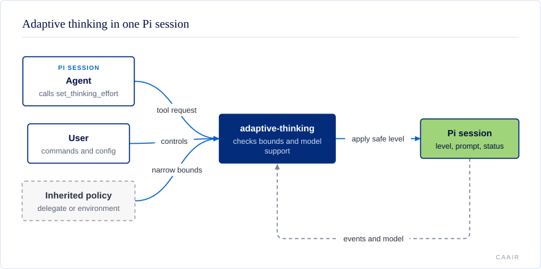

# @centerforagenticai/pi-adaptive-thinking

**Kind:** extension · **Status:** experimental · **Pi:** * · **Node:** >=22.19.0

Adaptive thinking lets an agent adjust how much reasoning its active model uses while keeping the user in control of the allowed range.

## What it does

The extension gives an agent a bounded way to raise or lower Pi's thinking effort, which is the amount of reasoning the model may use. It keeps a user-selected baseline, applies temporary agent overrides, and checks every level against the active model's capabilities.

- The `set_thinking_effort` tool changes effort for this response, the next N responses, or until changed.
- Prompt guidance tells the agent when to adjust effort and which levels are available.
- Commands and shortcuts let the user set the baseline, bounds, and direction.
- A status item shows the current level and the source of its ceiling.
- Read-only event-bus protocols expose current-session state and accept narrower delegate-worker policy.

## How it fits



Pi sends lifecycle and model events to the extension. The agent can call the registered tool, while the user controls the baseline and bounds through commands or `~/.pi/agent/adaptive-thinking.json`. Environment and `pi-delegate` policies can narrow those bounds but cannot widen them. The extension then updates Pi's thinking level, prompt guidance, and status item for that session.

## Install and enable

```sh
pi install npm:@centerforagenticai/pi-adaptive-thinking
```

Restart Pi or run `/reload` after installation. The package declares the Pi peer range `*`, is developed against Pi `0.84.2`, and requires Node `>=22.19.0`.

## Surface

| Kind | Name | Purpose |
| --- | --- | --- |
| Tool | `set_thinking_effort` | Set an agent override with a reason and a bounded scope. |
| Command | `/thinking-baseline <level\|status>` | Set or show the user's baseline. |
| Command | `/thinking-higher`, `/thinking-lower` | Move one supported level without wrapping. |
| Command | `/thinking-bounds <min> <max>` | Set or show the agent-selectable range. |
| Command | `/thinking-status` | Show baseline, effective level, bounds, model support, and policy source. |
| Command | `/thinking-reset` | Clear the current override and return to baseline. |
| Command | `/thinking-toggle` | Enable or disable agent-controlled changes. |
| Shortcut | `Alt+.`, `Alt+,` | Run `/thinking-higher` or `/thinking-lower`. |
| Status | Adaptive thinking level | Show the effective level and ceiling source. |
| Export | `@centerforagenticai/pi-adaptive-thinking/integration-seam` | Export the versioned snapshot protocol and its TypeScript types. |
| Events | `adaptive-thinking:snapshot:*:v1` | Request and observe read-only current-session snapshots. |
| Events | `pi-delegate:adaptive-thinking-policy` | Accept and acknowledge a narrower worker policy. |

The directional controls rebuild their candidates from the active model before each move. They preserve non-contiguous capability sets and use no endpoint wrapping. Force-adaptive models such as `claude-opus-5` omit `off`. The `Alt+.` and `Alt+,` chords use terminal escape sequences that avoid common window-manager shortcuts. `Shift+Tab` remains Pi's reserved thinking-cycle shortcut.

The package registers no skills or standalone command-line program.

## Configuration

Settings live in `~/.pi/agent/adaptive-thinking.json`. Missing or invalid values fall back to these defaults:

```json
{
  "baseline": "medium",
  "enabled": true,
  "minLevel": "low",
  "maxLevel": "xhigh"
}
```

| Key | Default | Meaning |
| --- | --- | --- |
| `baseline` | `"medium"` | Level used when no agent override is active. |
| `enabled` | `true` | Whether Pi offers `set_thinking_effort` to the agent. |
| `minLevel` | `"low"` | Lowest level the agent may select. Also accepts `"model-min"`. |
| `maxLevel` | `"xhigh"` | Highest level the agent may select. Also accepts `"model-max"`. |

The default ceiling is `xhigh`. The model's capabilities can narrow the configured range but cannot widen it. To explicitly permit agent-selected `max`, set `maxLevel` to `"max"`, or to `"model-max"` when `max` is the active model's highest level. Session-local delegate and inherited environment policies can narrow configuration further.

## When it runs

The extension starts no daemon and performs no periodic background work. It reacts inside the current Pi session:

- `session_start` restores state, resolves policy, applies a safe level, and publishes a snapshot.
- `input` and `before_agent_start` refresh model support, tool availability, inherited bounds, and the `<thinking-effort>` prompt block.
- `before_provider_headers` rejects a late level that would escape active policy.
- `agent_start` and `agent_end` track a run and decay response-scoped overrides.
- `turn_end`, `model_select`, and `thinking_level_select` refresh state, status, and snapshots.
- `session_shutdown` clears status and releases that session's inherited range.

The tool runs only when the agent calls it. Commands and shortcuts run only when the user invokes them. Snapshot requests and delegate-policy events run only when another loaded extension emits them.

## Develop

The source is maintained in a private repository and published as release snapshots; contributions are welcome as pull requests on [GitHub](https://github.com/CenterForAgenticAI/tools), which maintainers carry into the source repository.

```sh
npm install
npm run test:public
```

## Documentation

- [docs/usage-reference.md](docs/usage-reference.md): detailed tool, command, shortcut, and configuration behavior.
- [docs/integration-reference.md](docs/integration-reference.md): foreground-session snapshots and delegate-policy integration.

## License

MIT. See [LICENSE](LICENSE).
