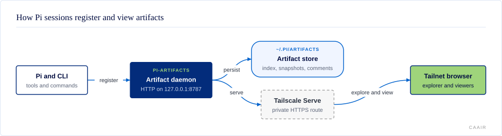

# @centerforagenticai/pi-artifacts

**Kind:** extension · **Status:** experimental · **Pi:** ^0.85.1 · **Node:** >=22

A cross-device registry and viewer for durable files produced by Pi sessions.

## What it does

`pi-artifacts` keeps fixed copies of reports, documents, media, and other
browser-viewable files. Its explorer and viewers make those artifacts available
from any device on the same Tailscale private network, called a tailnet.

- Register files from Pi or the command line, with version history and search.
- Read Markdown, HTML, PDF, code, images, video, audio, and other files.
- Review Markdown, code, and HTML with durable comments.
- Read selected artifacts offline or publish HTML and Markdown through an
  explicit PreviewShip action.
- Host small artifact-adjacent applets beside the explorer.

## How it fits



The Pi extension and `pi-artifacts` command-line interface send files to one
HTTP daemon. The daemon keeps metadata and versioned snapshots under
`~/.pi/artifacts/`, then serves the explorer, viewers, and applets. Tailscale
Serve can expose that local service to browsers on the same tailnet. Normal
registration stays inside the tailnet; PreviewShip publishing is a separate,
explicit action.

Read the [architecture reference](docs/architecture.md) for storage, URLs,
comments, applets, and extension details.

## Install and enable

Install the extension and bundled skills:

```sh
pi install npm:@centerforagenticai/pi-artifacts
```

Install and start the serving daemon on the machine that owns the artifact
store:

```sh
npm install
npm link
pi-artifacts install
```

Run `/reload` in Pi. This package needs Pi `^0.85.1` and Node `>=22`.
For a remote client, daemon options, or installation without Tailscale, read the
[operations reference](docs/operations.md).

## Surface

| Kind | Name | Purpose |
| --- | --- | --- |
| Tool | `artifact` | Add, retrieve, publish, list, remove, tag, or open artifacts. |
| Tool | `artifact_comments` | Read durable comments on one immutable artifact version. |
| Tool | `artifact_comment_create` | Post an explicit agent-authored review comment. |
| Tool | `artifact_comment_reply` | Reply to an existing artifact comment. |
| Commands | `/artifact`, `/artifact-publish`, `/artifacts`, `/artifacts-url` | Register or publish a file, list artifacts, or show the explorer URL. |
| CLI | `pi-artifacts` | Run and configure the daemon; manage artifacts and applets. |
| Skills | `pi-artifacts`, `pi-artifacts-authoring`, `pi-artifacts-reports`, `pi-artifacts-applets` | Guide registration, format choice, reports, and applet work. |
| Events | `session_start`, `resources_discover` | Report daemon status and expose bundled skills. |

Supported viewer formats remain part of the front-door contract:

| Kind      | Rendering |
|-----------|-----------|
| Markdown  | markdown-it + GitHub styling, **mermaid** diagrams, highlight.js code, DOMPurify-sanitized |
| HTML      | sandboxed `<iframe>` (self-contained docs keep their own CSS/JS) + metadata toolbar |
| PDF       | direct link — `/view/:id` 302-redirects to raw bytes so the browser/native viewer opens it |
| Code/text | highlight.js syntax highlighting |
| Image     | inline `` |
| Video     | native responsive `<video controls>` player with byte-range seeking |
| Audio     | native `<audio controls>` player with byte-range seeking |
| Other     | browser-native rendering in a restricted frame when possible; safe download fallback |

For range requests, large-text previews, printing, and offline behavior, read
the [viewer reference](docs/viewers.md).

## Configuration

The daemon reads `~/.pi/artifacts/config.json`. It uses these defaults:

```json
{
  "port": 8787,
  "host": "127.0.0.1",
  "clientScheme": "http"
}
```

Set `publicBaseUrl` only when automatic Tailscale Serve discovery is not
suitable; it has no default. `PI_ARTIFACTS_HOME`, `PI_ARTIFACTS_PORT`,
`PI_ARTIFACTS_HOST`, `PI_ARTIFACTS_CLIENT_SCHEME`, and
`PI_ARTIFACTS_PUBLIC_URL` override matching runtime values.
`PI_ARTIFACTS_MAX_UPLOAD_BYTES` changes the 4 GiB upload limit. The extension is
enabled when installed, but the serving daemon runs only after
`pi-artifacts install` or `pi-artifacts serve` starts it. The
[operations reference](docs/operations.md) covers operational settings and
remote client setup.

## When it runs

On `session_start`, the extension checks the daemon and shows whether it is
available. On `resources_discover`, it contributes its four bundled skills.
Artifact tools and slash commands run only when called. The daemon runs
continuously after installation and serves its HTTP API, explorer, viewers, and
applets; normal registration starts no external publish.

## Develop

The source is maintained in a private repository and published as release
snapshots; contributions are welcome as pull requests on
[GitHub](https://github.com/CenterForAgenticAI/tools), which maintainers carry
into the source repository.

```sh
npm install
npm test
```

## Documentation

- [Architecture](docs/architecture.md): daemon, store, URLs, comments, applets, and extension.
- [Viewers, printing, and offline mode](docs/viewers.md): rendering and browser behavior.
- [Analysis reports and GitLab references](docs/reports.md): report generation and evidence navigation.
- [Small applets](docs/applets.md): manifest, frontend, and backend contracts.
- [Installation and operations](docs/operations.md): daemon, CLI, remote clients, publishing, and repair.

## License

MIT. See [LICENSE](LICENSE).
