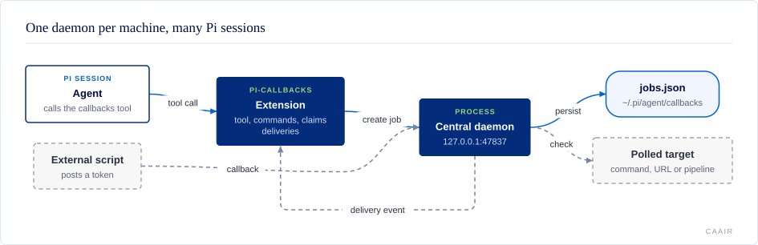

# @centerforagenticai/pi-callbacks

**Kind:** extension · **Status:** stable · **Pi:** ^0.85.1 · **Node:** >=22.19

Persistent reminders, polling checks, background script callbacks, and
token-based external callback hooks for Pi.

## What it does

When an agent needs to "wait for something," ad-hoc sleeps, polling loops, and
background scripts often fail to re-enter the agent context when the condition
happens. `pi-callbacks` gives the agent explicit mechanisms that can inject a
message later and optionally trigger a new agent turn.

- **Reminders** fire after a delay (`5m`, `30s`, `1h`).
- **Polls** run a command, fetch a URL, or watch a GitLab pipeline until a
  condition matches.
- **Scripts** run in the background and wake the session when they exit.
- **Callback tokens** let an outside script push a message back into a session.
- **Delivery targets** decide which session receives the result, including
  sessions other than the one that created the job.

## How it fits



One central daemon runs per user and machine. It owns the callback endpoint
(`http://127.0.0.1:47837/callback`), the timers, the polls, and the scripts, and
keeps every job in `~/.pi/agent/callbacks/jobs.json`. Pi sessions run no HTTP
server: they heartbeat, claim only the delivery events routed to them, and inject
those. Because the endpoint is stable, an external script can call back from
any session's job. How delivery works is in
[docs/delivery.md](docs/delivery.md); the design is in
[docs/architecture.md](docs/architecture.md).

## Install and enable

```sh
pi install npm:@centerforagenticai/pi-callbacks
```

Restart Pi or run `/reload`. The extension starts the daemon on session start and
again before it creates a job. It needs Pi `^0.85.1` and Node `>=22.19`. Named
GitLab pipeline polls also need `glab` installed and logged in.

## Surface

| Kind | Name | Purpose |
| --- | --- | --- |
| Tool | `callbacks` | `remind`, `poll`, `script`, `callback`, `list`, `info`, `cancel`, `delete`. |
| Command | `/callbacks` | List active jobs for this session (`--all`, `--history`). |
| Command | `/remind-in <duration> <message>` | Create a reminder. |
| Command | `/callback-token [message]` | Mint a callback token. |
| Command | `/callback-cancel`, `/callback-delete` | Cancel or delete a job by id or token. |
| CLI | `pi-callbacks start`, `status`, `endpoint`, `daemon`, `callback` | Control the daemon and post a callback. |
| Skill | `pi-callbacks` | Tells the agent when to use callbacks instead of sleeping. |
| Service | pending-work service v1 | Read-only `count`, `nextDueAt`, `openEndedCount` over Pi's event bus. |

Every action, flag, and example is in [docs/reference.md](docs/reference.md).

## Configuration

Settings live in `~/.pi/agent/callbacks/config.json` (under `PI_CALLBACKS_DIR`
when set):

```json
{
  "version": 1,
  "defaultTarget": "latest-active-cwd",
  "checkInIntervalMs": 1800000,
  "checkInTriggerTurn": true,
  "sleepReminderMinSeconds": 10
}
```

`null` disables check-ins or the sleep reminder. Invalid values fail closed with
a configuration error rather than silently changing where a callback goes.
Check-in behaviour is in [docs/polling.md](docs/polling.md) and target names are
in [docs/delivery.md](docs/delivery.md).

## When it runs

The extension hooks `session_start`, `session_compact`, `session_tree`,
`before_agent_start`, `input`, `agent_end`, and `session_shutdown` to keep its
delivery loop bound to a fresh context, and `tool_call` to send an advisory
reminder when a bash command sleeps in a loop. A graceful session close removes
that session's origin-targeted jobs; a resource reload preserves them.

## Develop

The source is maintained in a private repository and published as release snapshots;
contributions are welcome as pull requests on
[GitHub](https://github.com/CenterForAgenticAI/tools), which maintainers carry into the
source repository.

```sh
npm install
npm test
```

## Documentation

- [docs/architecture.md](docs/architecture.md): daemon, store, and pending-work service.
- [docs/reference.md](docs/reference.md): tool actions, commands, daemon CLI, external callbacks.
- [docs/polling.md](docs/polling.md): poll conditions and periodic check-ins.
- [docs/delivery.md](docs/delivery.md): delivery modes and targets.
- [docs/development.md](docs/development.md): public test setup and test-isolation rules.

## License

MIT. See [LICENSE](LICENSE).
