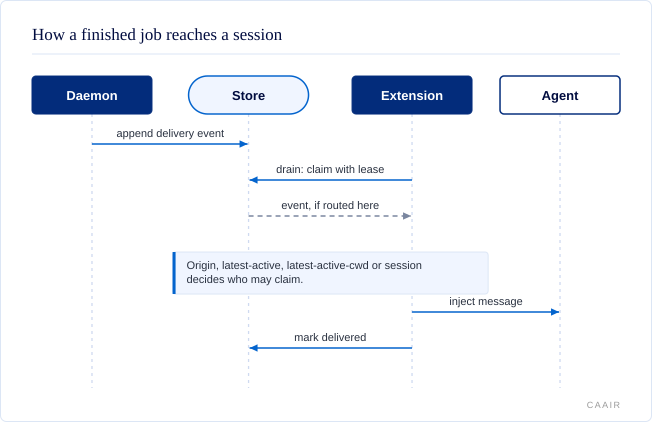

# Delivery modes and targets

For operators: how a finished callback is injected into a session, and which session receives it.



## Delivery modes

- `custom` (default): injects a custom `pi-callbacks` message and triggers a turn by default.
- `user`: injects a user message.
- `notify-only`: only shows a UI notification.

Delivery mode controls **how** a callback is injected. Delivery target controls
**where** it goes.

## Delivery targets

Each new job records its origin session and a target:

- `origin` (default): only the exact session that created the job. An active
  origin-targeted job does not survive when that origin session ends (except a
  resource reload); it is discarded rather than redirected, and the loss is
  reported by `callbacks list`.
- `latest-active`: whichever live Pi session was active most recently. Jobs using
  this target survive origin-session shutdown.
- `latest-active-cwd`: the most recently active live session whose cwd matches
  the job's origin cwd. Jobs using this target also survive origin-session
  shutdown.
- `session`: a dedicated session selected by exact session ID or session-file
  path; set the selector with `targetSession`.
- `desktop`: a macOS desktop notification delivered by the daemon. This target
  does not inject a Pi conversation message and is rejected on non-macOS hosts.

For example:

```json
{
  "action": "remind",
  "delay": "10m",
  "message": "Check the deploy",
  "target": "latest-active-cwd"
}
```

An explicit dedicated session uses both fields:

```json
{
  "action": "callback",
  "message": "Release pipeline finished",
  "target": "session",
  "targetSession": "/absolute/path/to/session.jsonl"
}
```

Set the package-wide default for newly created jobs in
`~/.pi/agent/callbacks/config.json` (or under `PI_CALLBACKS_DIR` when that test or
runtime override is set):

```json
{
  "version": 1,
  "defaultTarget": "latest-active-cwd"
}
```

`defaultTarget` accepts any target name above. An explicit session can be
written as `"session:<session-id-or-absolute-file-path>"` or as
`{"kind":"session","session":"<selector>"}`. Per-job `target` values override
the package default. Configuration is read when a job is created, so changing it
does not retarget existing jobs. Invalid configuration fails closed with a
configuration error rather than silently changing the delivery destination. The
check-in settings are also read by the daemon on reconciliation.

Delivery is a two-step handoff: the daemon appends a delivery event to the
shared store, then a target resolver selects a live session and that session
claims the event with a short lease before injecting it. This prevents two Pi
sessions from consuming the same event. The extension drains once on session
start and then on an interval, and it also rebinds its delivery loop when session
lifecycle events such as compaction, tree navigation, user input, or agent turns
provide a fresh extension context. If a stale session context is detected, the
claim is released and the loop pauses instead of marking the event delivered;
the next fresh context restarts the loop and flushes the backlog. `/callbacks`
and `callbacks action="info"` surface pending delivery events so "job completed
but message not delivered" is visible. Empty delivery polls stay on the read
path and do not acquire the cross-process SQLite writer lock. If a background
claim or heartbeat still encounters transient SQLite contention, the extension
reports `store busy` and retries with bounded exponential backoff instead of
letting the timer error terminate Pi. Non-contention store errors remain visible.

Origin-targeted active jobs follow their origin session's lifecycle. A graceful
session close (`quit`, `new`, `resume`, or `fork`) removes them immediately,
including undelivered origin events. A resource reload preserves them so the
replacement extension runtime can resume delivery. A dead host PID is removed
after the two-minute heartbeat grace. An ended in-process runtime can share a
still-live parent PID, so PID liveness alone is not authoritative: after its
heartbeat expires, the daemon marks that presence stale and requires a second
uninterrupted two-minute grace before removal. A resumed heartbeat clears the
marker, protecting laptop sleep and temporary event-loop suspension. Jobs
targeted anywhere other than `origin` survive origin shutdown and remain
available for their redirected destination.
