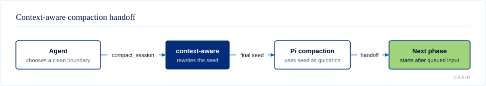
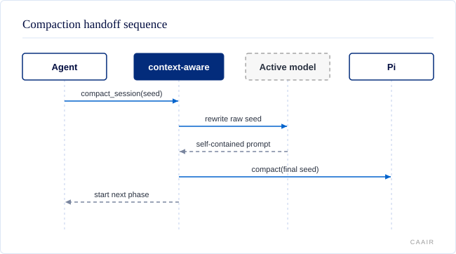

# @centerforagenticai/pi-context-aware

**Kind:** extension · **Status:** stable · **Pi:** * · **Node:** >=22.19.0

Context-aware helps long Pi sessions keep their purpose through compaction. It tracks context pressure, turns short handoff seeds into self-contained prompts, and carries durable focus, tasks, and selected reference material into the next phase.

## What it does

- Shows context pressure and usable output headroom without changing the prompt on every tool call.
- Rewrites `/compact-then` and `compact_session` seeds before Pi compacts the conversation.
- Can compact proactively when context usage or output headroom reaches a configured limit.
- Preserves a prior-transcript reference and exposes bounded prior-session search.
- Keeps optional durable focus, session tasks, and scoped context-cache documents across compaction.
- Repairs orphaned tool results before provider requests leave the process.
- Offers a typed protocol-v1 service for other Pi extensions.

The detailed behavior, recovery rules, and examples are in [commands and concepts](docs/commands-and-concepts.md).

## How it fits





The agent starts a handoff with `compact_session` or `/compact-then`. Context-aware resolves or generates a raw seed, asks the active model to rewrite it when rewriting is enabled, then gives the final seed to Pi as compaction guidance. After Pi drains queued input, context-aware delivers the seed once to start the next phase. In a worker session, it records a round-boundary request instead of starting a new turn.

The extension also listens to Pi lifecycle events. It records stable telemetry, task, focus, cache, and transcript metadata in the session without treating those records as user instructions.

## Install and enable

Install the public package with Pi:

```sh
pi install npm:@centerforagenticai/pi-context-aware
```

Restart Pi or run `/reload`. The package declares Pi peer dependencies as `*`; its deterministic compatibility gate currently pins and tests Pi `0.84.2`. It needs Node `>=22.19.0`.

For a local checkout, add its absolute path to the `packages` array in `~/.pi/agent/settings.json`, run `npm run build`, then restart Pi or run `/reload`. The manifest loads `./dist/index.js`.

For seeded automatic handoffs, let context-aware own automatic compaction and turn off Pi's native automatic threshold checks:

```json
{
  "compaction": { "enabled": false }
}
```

Manual `/compact`, `/compact-then`, and `compact_session` remain available. See [configuration](docs/configuration.md) for ownership warnings and the complete settings.

## Surface

| Kind | Name | Purpose |
| --- | --- | --- |
| Tool | `compact_session` | Compact at a clean phase boundary and continue from a self-contained seed. Available when `summarizer.enabled` is `true`. |
| Tool | `session_focus` | Read or update one optional durable objective. |
| Tool | `session_tasks` | Maintain a one-level checklist that survives compaction. |
| Tool | `search_prior_sessions` | Search bounded transcript snippets from earlier sessions or compacted-away current history. |
| Tool | `session_recall` | Search the context cache and session history together. |
| Tool | `session_compaction_history` | Report current-branch compaction counts and boundary identifiers. |
| Command | `/compact-then [seed] [--model provider/id]` | Run the seeded handoff flow. Available when `summarizer.enabled` is `true`. |
| Commands | `/context-status`, `/context-aware-*` | Inspect pressure and configure seed, model, ambiguity, and proactive behavior. |
| Commands | `/focus`, `/sessions`, `/tasks`, `/checkin` | Inspect durable workstream state, task state, and session health. |
| Commands | `/context-cache-*` | Inspect and manage scoped context-cache documents. |
| Export | `@centerforagenticai/pi-context-aware/context-service` | Discover the typed protocol-v1 service over `pi.events`. |

Every command, parameter, and example is in [commands and concepts](docs/commands-and-concepts.md), [configuration](docs/configuration.md), and [session tasks](docs/session-tasks.md). The service contract is in [context-service.md](docs/context-service.md).

## Configuration

Settings come from built-in defaults, `~/.pi/agent/context-aware.json`, trusted project `.pi/context-aware.json`, CLI flags, session policy, and host policy. Later layers win per key.

| Key | Default | Purpose |
| --- | --- | --- |
| `seedMode` | `"auto-gen"` | Generate a seed when `/compact-then` has none. |
| `seedRewrite` | `true` | Rewrite raw seeds into self-contained prompts. |
| `seedAuthorityGuard` | `"warn"` | Check generated handoffs against session authority. |
| `ambiguityMode` | `"inherit"` | Ask, proceed cautiously, or proceed automatically when a seed is unclear. |
| `compactionModel` | `null` | Use the active model unless a summary model is named. |
| `overflowFallbackModel` | `null` | Keep overflow recovery on the primary model unless another model is named. |
| `summarizer.enabled` | `true` | Own the compaction summary hook and register handoff surfaces. |
| `proactiveCompaction.enabled` | `true` | Prepare a handoff before the context limit; threshold defaults to `0.78`. |
| `contextCache.enabled` | `true` | Surface scoped cache documents; the default scope is `"worktree"`. |
| `restartNotice.enabled` | `true` | Remind the agent to re-check volatile state after time away. |
| `workstream.enabled` | `true` | Enable durable focus and bounded session projections. |
| `sessionNaming.scope` | `"all"` | Name sessions with a bounded lightweight-model chain. |

Read [configuration](docs/configuration.md) for the full JSON shape, every leaf, precedence details, runtime flags, defaults, and recovery behavior.

## When it runs

The extension starts session-scoped services on `session_start` and tears them down on `session_shutdown`. It adds stable context guidance before agent work, appends one pressure snapshot per outer user turn, and updates pressure after messages, model changes, and turns.

At `turn_end` and `agent_settled`, it may prepare proactive compaction, continue an active task list, name the session, or record durable activity. At `session_before_compact`, it can produce the summary, cache artifacts, and handoff metadata. At `session_compact`, it records the completed boundary and schedules the next-phase seed. Features stay idle when disabled, when no relevant state exists, or when a worker host owns the round boundary.

## Develop

The source is maintained in a private repository and published as release snapshots; contributions are welcome as pull requests on [GitHub](https://github.com/CenterForAgenticAI/tools), which maintainers carry into the source repository.

```sh
npm install
npm test
```
## Documentation

- [docs/overview.md](docs/overview.md): the previous README's detailed product overview and installation reference, preserved verbatim.
- [docs/commands-and-concepts.md](docs/commands-and-concepts.md): workflows, commands, compaction concepts, model routing, and recovery.
- [docs/configuration.md](docs/configuration.md): complete configuration reference, defaults, precedence, and runtime overrides.
- [docs/session-tasks.md](docs/session-tasks.md): task-list statuses, tool actions, continuation, and delegation contract.
- [docs/integration.md](docs/integration.md): cross-extension protocol overview.
- [docs/development.md](docs/development.md): public install and test commands.
- [docs/diagrams/](docs/diagrams/): generated architecture diagram and its JSON source.
- [docs/context-service.md](docs/context-service.md): typed protocol-v1 discovery, operations, events, and bounds.

## License

MIT. See [LICENSE](LICENSE).
