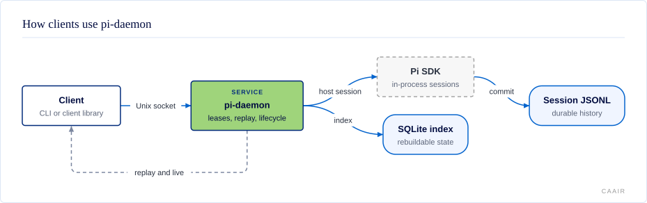

# @centerforagenticai/pi-daemon

**Kind:** service · **Status:** experimental · **Pi:** 0.99.2 · **Node:** >=24

## What it does

`pi-daemon` runs headless Pi agent sessions in one long-lived local process. A client can create or resume a session, replay committed history, follow live output, answer extension questions, and drive work without keeping a terminal open.

- Work continues after the client that started it disconnects.
- Each session has one time-limited driver lease, while any number of watchers can observe it.
- Durable cursors resume committed history. A `gap` reports lost live-only updates.
- Sleeping sessions release their in-memory Pi runtime but keep their identity and history.
- The protocol has matching TypeScript types, runtime validators, and JSON Schema.

## How it fits



The CLI and client library connect to one daemon over a private Unix socket. The daemon hosts sessions in-process through the Pi SDK; it does not use `pi --mode rpc`. Pi's append-only session JSONL is the durable history. The daemon keeps a rebuildable SQLite index for session, lease, lifecycle, and prompt state, then streams replayed and live frames to clients.

## Install and enable

Install the public package from npm:

```sh
npm install @centerforagenticai/pi-daemon
npx pi-daemon start
npx pi-daemon status
```

The package requires Pi `0.99.2`, Node `>=24`, and Linux with Unix-domain sockets, `/proc`, and user ownership checks. The daemon needs a Pi agent directory and provider configuration before a session can call a model. It uses `~/.pi/agent` by default.

`start` launches a detached daemon. Use `npx pi-daemon start --foreground` under a process supervisor. If `status` or `start` reports an SDK-incompatible daemon, its JSON includes a recovery hint; `npx pi-daemon start --replace` replaces it only when there is no working/blocked session and no attached reader. Older daemons without guarded shutdown must be stopped manually when idle. See the [CLI and client reference](docs/reference.md) for stop, list, open, sleep, and wake commands.

## Surface

| Kind | Name | Purpose |
| --- | --- | --- |
| CLI | `pi-daemon` | Start, stop, inspect, and manage the local daemon and its sessions. |
| Export | `@centerforagenticai/pi-daemon` | Embed the daemon or use its host, registry, state, stream, and lifecycle APIs. |
| Export | `@centerforagenticai/pi-daemon/client` | Connect, send typed requests, attach, hold leases, and consume streams. |
| Export | `@centerforagenticai/pi-daemon/protocol` | Use protocol types, constants, validators, and the canonical schema object. |
| Export | `@centerforagenticai/pi-daemon/testing` | Use deterministic provider helpers in conformance tests. |
| Schema | `@centerforagenticai/pi-daemon/protocol/protocol-1.0.schema.json` | Validate protocol frames outside TypeScript. |

This service declares no Pi extension, tools, commands, skills, or event handlers. The CLI covers operations for people and process supervisors. Prompting, streaming, steering, and answering UI requests use the client library or the local protocol.

## Configuration

The daemon reads these environment variables:

| Variable | Default | Meaning |
| --- | --- | --- |
| `PI_DAEMON_SOCKET` | `$XDG_RUNTIME_DIR/pi-daemon/pi-daemon.sock`, otherwise `~/.local/state/pi-daemon/run/pi-daemon.sock` | Absolute path to the private Unix socket. |
| `PI_DAEMON_STATE_DIR` | `$XDG_STATE_HOME/pi-daemon`, otherwise `~/.local/state/pi-daemon` | Directory for the registry, singleton lock, and diagnostic log. |
| `PI_DAEMON_AGENT_DIR` | `~/.pi/agent` | Pi configuration and session root. |

The socket parent is mode `0700`, and the socket is mode `0600`. Filesystem ownership authenticates one local operating-system account. The service is not a remote or multi-user security boundary. See [Configuration and local files](docs/reference.md#configuration-and-local-files) for the files it creates.

## When it runs

The service runs after `pi-daemon start`, or when `connectDaemon()` cannot connect and auto-spawn is enabled. It stays alive until `pi-daemon stop`, a process signal, or a fatal failure. A client request creates, opens, wakes, sleeps, or drives a session; the daemon does no model work on its own.

Several sessions may be awake in the same Node process. Their extensions can share ES-module state, the current working directory, environment variables, listeners, and timers. Load only extensions you trust to share that process.

## Develop

The source is maintained in a private repository and published as release snapshots; contributions are welcome as pull requests on [GitHub](https://github.com/CenterForAgenticAI/tools), which maintainers carry into the source repository.

From the exported package directory:

```sh
npm install
node scripts/public-release-smoke.mjs
```

## Documentation

- [Client, protocol, storage, and operations reference](docs/reference.md)
- [Original concise install and development reference](docs/original-readme-reference.md)
- Architecture decisions: [in-process SDK hosting](docs/adr/0001-in-process-sdk-hosting.md), [committed cursor and bounded live events](docs/adr/0002-committed-entry-cursor-bounded-live.md), [Unix socket JSONL](docs/adr/0003-unix-socket-jsonl.md), and [single driver lease](docs/adr/0004-single-driver-lease.md)
- [Architecture diagram](docs/diagrams/architecture.svg)

## License

MIT. See [LICENSE](LICENSE).
