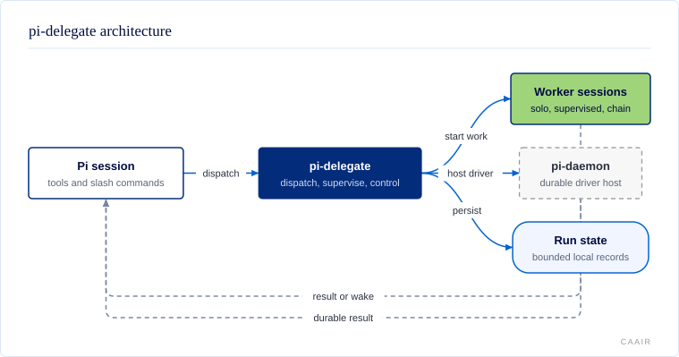

# @centerforagenticai/pi-delegate

**Kind:** extension · **Status:** stable · **Pi:** latest · **Node:** >=22.19

## What it does

pi-delegate runs specialist agents from a Pi session and returns one result for each run. Work can run independently, through a private supervisor, as an ordered chain, or in a durable driver session.

- Dispatch parallel or ordered workers without filling the main conversation with their transcripts.
- Add a private supervisor that can review and redirect a worker before returning one answer.
- Keep the foreground responsive with background completion wakes, inspection, cancellation, recovery, and escalation.
- Isolate worker changes in Git worktrees and confine writes to approved roots.
- Keep read-only workers useful for inspection: literal `/dev/null` redirection,
  file-descriptor duplication, and safe read-only Git forms remain available;
  Git output, executable-helper, and global config-injection options are refused.
- Use the same production handlers from a Node client, Fabric, or another Pi extension.

Read [Using pi-delegate](docs/usage.md) for the complete behavior and examples.

## How it fits



The Pi session calls the extension's tools or slash commands. pi-delegate starts direct workers, private supervisor-and-worker pairs, or a durable driver hosted by pi-daemon. It stores bounded run state, then returns the result directly or wakes the owning session when background work finishes.

## Install and enable

### Installation

Install the public npm package with Pi:

```sh
pi install npm:@centerforagenticai/pi-delegate
```

Restart Pi or run `/reload`. The package supports the Pi versions shown above and needs Node `>=22.19`.

The bundled `delegate`, `worker`, and `publisher` agents are available immediately. Install compatible workflow-agent packages separately when you need roles such as `scout`, `planner`, `reviewer`, `implementer`, or `integrator`.

## Surface

| Kind | Name | Purpose |
| --- | --- | --- |
| Tool | `delegate` | Dispatch runs or manage agent and chain definitions. |
| Tool | `delegate_control` | Inspect, collect, steer, follow up, answer, cancel, or recover accepted runs. It appears only when there is work to control. |
| Tool | `delegate_escalation` | List, resolve, or pass up durable worker escalations when escalation is enabled. |
| Commands | `/delegate`, `/delegate-help` | Dispatch work, list resources, inspect health, or show help. |
| Commands | `/delegate-cancel`, `/delegate-inspector` | Cancel live work or open the transcript inspector. |
| Command | `/delegate-only` | Enable, disable, or inspect the constrained foreground mode. |
| Skills | `pi-delegate`, `authoring-delegate-agents`, `delegate-only`, `merge-coordinate`, `orchestrate-work` | Use the tool surface, author agents, operate in delegate-only mode, integrate lanes, and coordinate multi-lane work. |
| Agents | `delegate`, `worker`, `publisher` | Built-in dispatch, execution, and gate-and-push roles. |
| Exports | package root, `./events`, `./fabric`, `./escalations`, `./skill-resource` | Programmatic dispatch, event names, Fabric, escalation, and skill-resource APIs. |
| Events | `delegate:*` | Versioned in-process run lifecycle and control notifications. |

A minimal tool call is `delegate({ runs: [{ agent: "reviewer", task: "Review the change." }] })`. Read the [tool and API reference](docs/delegate-tool-api.md), [runtime API](docs/runtime-api.md), and [event-bus reference](docs/integrations.md#event-bus-channels) for every field and limit.

## Configuration

The optional file `~/.pi/agent/config/pi-delegate/config.json` controls global defaults. A sibling `config.local.json` overlays it for machine-local values.

| Area | Built-in behavior |
| --- | --- |
| Worktrees and duration | No setup hook; no global duration ceiling or floor. |
| Tool and skill baseline | No extra global grants. Agent and invocation policy still applies. |
| Escalation | Off; the native escalation UI is enabled when escalation is turned on. |
| Inspector | Full layout, thinking preview, tool chips, persistent completion view. |
| Completion | Background dispatch and early failure notices are enabled. |
| Activity ticker | Enabled with deterministic counts; no model call unless a model is configured. |
| Prompt-template bridge | Auto-detect whether pi-delegate should handle requests. |

Read [Configuration](docs/configuration.md) for every key, environment variable, precedence rule, default, limit, and failure mode. Saved agent and chain definitions can contain plaintext environment values; keep secrets in the process environment or a secret manager.

## When it runs

The extension registers its main surface when Pi loads it. Ordinary dispatch runs in the background unless the caller sets `await: true`; completion wakes the owning foreground session. Supervised runs keep a private supervisor loop in process. Driver runs return after pi-daemon accepts the prompt and can outlive the caller.

The extension hooks `resources_discover`, `before_agent_start`, `session_start`, `session_shutdown`, `turn_start`, and `turn_end`. These hooks load the bundled skill, restore bounded state, deliver pending results, refresh the status widget and activity ticker, and reconcile interrupted work. The extension stays idle when no run, pending delivery, or enabled foreground mode needs it. Read [Using pi-delegate](docs/usage.md#background-dispatch-vs-awaiting-completion) for the full lifecycle.

## Develop

The source is maintained in a private repository and published here as release snapshots; contributions are welcome as pull requests on [GitHub](https://github.com/CenterForAgenticAI/tools), which maintainers carry into the source repository.

```sh
npm install
node scripts/public-release-smoke.mjs
```

## Documentation

### User and API reference

- [Using pi-delegate](docs/usage.md)
- [Agent definitions](docs/agent-definitions.md)
- [Configuration](docs/configuration.md)
- [Security](docs/security.md)
- [Integrations and migration](docs/integrations.md)
- [Delegate tool and API](docs/delegate-tool-api.md)
- [Programmatic runtime API](docs/runtime-api.md)
- [CLI delegation](docs/cli-delegate.md)
- [Package-shipped agents](docs/package-agents.md)
- [Escalation](docs/escalation.md)
- [Activity ticker](docs/activity-ticker.md)
- [Heartbeat](docs/heartbeat.md)
- [Fabric mode](docs/fabric-mode.md)
- [Write confinement](docs/write-confinement.md)
- [Run history](docs/run-history.md)
- [Active delegated-work contract](docs/active-delegate-work-contract.md)
- [Early failure recovery](docs/early-failure-recovery.md)
- [Prompt-template bridge](docs/prompt-template-bridge.md)
- [Prompt-template-model support](docs/ptm-support.md)
- [Generated diagram source and SVG](docs/diagrams/)
- [Architecture and model index](.spec/model/README.md)
- [Architecture context](.spec/CONTEXT.md)

<details>
<summary>Internal project records (excluded from the public package)</summary>

- [Dispatch evidence verification](docs/565-dispatch-evidence-verification.md)
- [Cross-session recovery](docs/cross-session-recovery.md)
- [Delegate-only measurement](docs/delegate-only-measurement.md)
- [Escalation downstream integration](docs/escalation-downstream-integration.md)
- [Escalation shakeout results](docs/escalation-shakeout-results.md)
- [Implementer agent](docs/implementer-agent.md)
- [Timeout contract](docs/issue-57-timeout-contract.md)
- [Phase 1 injection notes](docs/phase1-injection-notes.md)
- [Phase 3 investigation](docs/phase3-investigation.md)
- [Release process](docs/releasing.md)
- [Retry-lineage merge design](docs/retry-lineage-merge-design.md)
- [Reviewed node execution](docs/reviewed-node-execution.md)
- [Subagent parity plan](docs/subagent-parity-plan.md)
- [Verification 566 parity](docs/verification-566-parity.md)
- [Verification 567 lifecycle](docs/verification-567-lifecycle.md)

</details>

## License

MIT. See [LICENSE](LICENSE).
