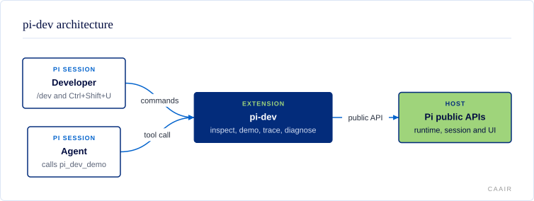

# @centerforagenticai/pi-dev

**Kind:** extension · **Status:** experimental · **Pi:** * · **Node:** >=24

## What it does

`pi-dev` is a workbench for developing Pi extensions. It inspects the live
public extension runtime, demonstrates supported terminal user interface (TUI)
surfaces, traces lifecycle metadata, and diagnoses integration state.

- Inspect active tools, prompts, context, usage, and extension provenance.
- Exercise tools, renderers, dialogs, overlays, widgets, and other public APIs.
- Trace allowlisted event metadata without retaining prompts or tool data.
- Load extension-authoring guidance only when a session asks for it.

## How it fits



A developer uses `/dev` and `Ctrl+Shift+U`; an agent can call `pi_dev_demo`.
The extension reads only Pi's public runtime, session, and UI APIs. With
`--pi-dev-mode`, it also adds an authoring pointer and the
`authoring-pi-extensions` and `developing-pi-extension-repos` skills for that
session.

## Install and enable

Install the package, then restart Pi or run `/reload`:

```sh
pi install npm:@centerforagenticai/pi-dev
```

To try the extension once without installing it:

```sh
pi -e ./index.ts
```

It needs Node `>=24`. `package.json` accepts any Pi version through the `*` peer
range; the current development dependency is `^0.85.1`.

## Surface

| Kind | Name | Purpose |
| --- | --- | --- |
| Command | `/dev` | Inspect runtime state, run demos, trace events, and run diagnostics. |
| Tool | `pi_dev_demo` | Echo text through the extension tool and rendering path. |
| Shortcut | `Ctrl+Shift+U` | Open the live context-usage overlay. |
| Flag | `--pi-dev-mode` | Add extension-authoring guidance and resources for one session. |
| Skill | `authoring-pi-extensions` | Document the current extension API; available only with `--pi-dev-mode`. |
| Skill | `developing-pi-extension-repos` | Keep extension-repository tests, dependencies, CI reproduction, and coverage reliable; available only with `--pi-dev-mode`. |
| Export | `@centerforagenticai/pi-dev` | Reusable inspection, tracing, diagnostics, and context-usage helpers. |
| Export | `@centerforagenticai/pi-dev/testing` | Build a public-API conformance context for extension tests. |
| Renderers | `pi-dev-demo-message`, `pi-dev-demo-entry`, `pi-dev-presentation` | Render demo messages and durable entries. |

See [docs/commands.md](docs/commands.md) for every `/dev` subcommand and
[docs/public-api.md](docs/public-api.md) for exported core functions and known
limits.

## Configuration

The extension reads no configuration file or environment variable. It is active
when installed. Extension-authoring mode is off by default; pass
`--pi-dev-mode` when starting Pi to enable it for that session.

## When it runs

The command, tool, shortcut, flag, and renderers register when Pi loads the
extension. Most work starts only when a developer runs `/dev`, uses the
shortcut, or an agent calls `pi_dev_demo`.

Event tracing is opt-in and remains in memory. When enabled, it observes Pi
lifecycle, model, message, tool, input, and provider events through a strict
metadata allowlist. The extension also handles `before_agent_start` and
`resources_discover` when `--pi-dev-mode` is active, plus `session_start` and
`session_shutdown` to restore enabled UI demos. See
[docs/event-tracing.md](docs/event-tracing.md) and
[docs/authoring-mode.md](docs/authoring-mode.md).

## Develop

```sh
npm ci
npm run check
```

`npm run check` runs lint, type checks, build and package smoke tests, coverage,
and a live RPC test. Read [docs/development.md](docs/development.md) for the
full test and dependency notes.

## Documentation

- [docs/commands.md](docs/commands.md): `/dev` commands and context-usage controls.
- [docs/authoring-mode.md](docs/authoring-mode.md): optional authoring guidance and skills.
- [docs/event-tracing.md](docs/event-tracing.md): event metadata and privacy rules.
- [docs/public-api.md](docs/public-api.md): reusable exports and public API limits.
- [docs/development.md](docs/development.md): tests, package smoke, and dependencies.
- [docs/diagrams/](docs/diagrams/): architecture diagram source and generated SVG.

## License

MIT. See [LICENSE](LICENSE).
