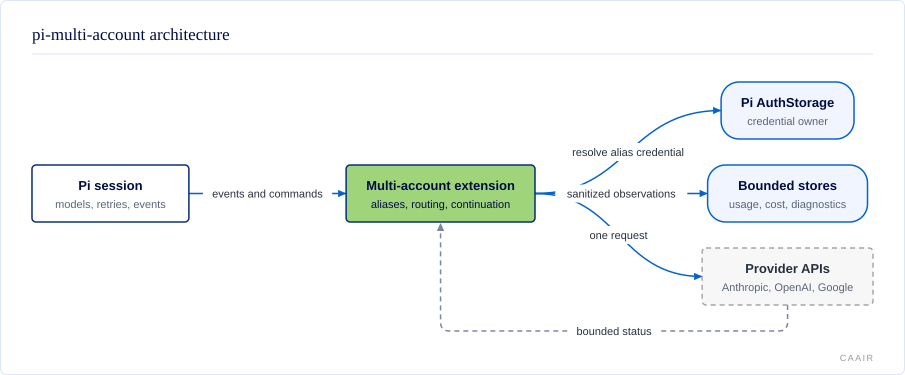

# @centerforagenticai/pi-multi-account

**Kind:** extension · **Status:** experimental · **Pi:** 0.84.4 · **Node:** >=22.19

Concurrent Anthropic, OpenAI Codex, and Google Antigravity OAuth accounts for Pi, with bounded failover, usage and cost history, and an opt-in metered last resort.

## What it does

When a managed account reaches a limit or loses authorization, `pi-multi-account` waits for Pi's own retries to settle, selects an eligible route, and sends one fixed continuation. It never replays the failed provider request, with one bounded exception: a `unified` logical call that fails before showing any output may move once to another account serving the same model.

- Registers numbered OAuth account aliases without copying credentials out of Pi's `AuthStorage`.
- Routes within a provider family first, then through explicit owning-vendor or cross-family policy.
- Adds an optional `unified` logical provider for exact model selection across eligible accounts.
- Retains bounded, sanitized usage, cost, and diagnostic records.
- Keeps OpenRouter off unless the operator supplies exact consent, a model, credentials, and a daily cap.

## How it fits



Pi owns sessions, model selection, credentials, and its provider retry loop. This extension adds account aliases, route policy, one post-settlement continuation, and read-only status surfaces. Provider traffic still uses Pi's native Codex transport or the reviewed provider code bundled with this package. See [Architecture](docs/architecture.md) and [Routing and recovery](docs/routing.md).

## Install and enable

Pi extensions run with your user permissions. Review the source before installation.

```sh
pi install npm:@centerforagenticai/pi-multi-account
```

Restart Pi or run `/reload`, then authenticate each managed slot through Pi's `/login` flow. Run `/multi-account rediscover` after adding or changing credentials. The package requires Node.js `>=22.19` and is developed and verified against Pi `0.84.4`.

The package bundles reviewed Anthropic OAuth and Google Antigravity source under their original MIT licenses. It does not fetch the private fork package names at installation time. See [Accounts and provider integration](docs/accounts.md).

## Surface

| Kind | Name | Purpose |
| --- | --- | --- |
| Command | `/multi-account` | Status, limits, models, cost, diagnostics, account lifecycle, routing policy, and account groups. |
| Command | `/multi-account-model [id]` | Deprecated one-release alias for `/multi-account model [id]`. |
| Tool | `multi_account_status` | Read-only `status`, `limits`, `models`, `cost`, and `log`. |
| Provider | numbered account aliases | Separate Anthropic, OpenAI Codex, and Google Antigravity OAuth slots. |
| Provider | `unified` | Optional exact-model logical provider generated from managed catalogs. |
| CLI | `multi-account` | Offline cost reports, pricing refresh, period closure, and account plan history. |
| Export | exact-model route resolver v1 | Read-only, credential-free route policy for code consumers. |
| Export | `./public-status` v1 | Read-only live account status for other extensions over `pi.events`. |

Every subcommand and argument is in [Commands, tools, and autocomplete](docs/commands.md). The resolver contract is in [Routing and recovery](docs/routing.md).

### Public account status subpath

Import `@centerforagenticai/pi-multi-account/public-status` and call `discoverPublicAccountStatusReader(pi.events)`. Use the package name your installation resolves: the package is installed under its published name. The subpath is a plain JavaScript module with no imports, so plain Node can load it and it never loads the extension or Pi. The v1 contract uses the query channel `pi-multi-account:public-status-service-query:v1` and returns a `public-status-v1` snapshot, or `owner-unavailable` until `session_start` finishes and after `session_shutdown`, and `source-error` when the owner fails. Version 1 covers only Anthropic and OpenAI Codex accounts; Google Antigravity accounts are omitted. Each account's `label` is the label you configured in `accountLabels`, or else the provider id. It is never read from a token. The read itself writes nothing, but the first read of a new UTC day schedules the once-a-day cost period closer, which can refresh OpenRouter pricing over the network and append day digests. See [Commands, tools, and autocomplete](docs/commands.md#public-live-account-status-public-status).

## Configuration

The extension reads one machine-global file and no project-local config:

```text
$PI_CODING_AGENT_DIR/pi-multi-account/config.json
```

When `PI_CODING_AGENT_DIR` is unset, the root is `~/.pi/agent`. Missing configuration uses conservative defaults. Same-family failover and usage fetches ship on; cross-family routing and OpenRouter ship off. Malformed or unknown fields keep discovery, `/login`, and repair commands available, but block requests and automatic routing until valid config is loaded. Correct the global config and run `/multi-account reload` or `/reload`. A failed reload retains the last valid policy.

| Key | Default | Purpose |
| --- | --- | --- |
| `accountLimit` | `4` | Slots per managed family, from `1` through `32`. |
| `sameFamilyFailover` | `true` | Permit another eligible account in the same family. |
| `crossFamilyChainEnabled` | `false` | Enable only the directional transitions in `crossFamilyChains`. |
| `preferredModels` / `tierModelMap` | `{}` | Resolve explicit cross-family and cross-tier model identity. |
| `accountGroups` and defaults | `{}` | Restrict a session, exact cwd, or global fallback to named account allow-lists. |
| `usageFetchEnabled` | all managed families `true` | Enable fail-soft provider usage fetches. |
| `imageStripping` | off | Stopgap: replace images older than the newest `keepNewest` image-bearing messages in `unified` and Anthropic alias requests. See [Removing old images](docs/configuration.md#removing-old-images-stopgap). |

Account groups may list exact configured Pi provider IDs, including built-in API
and custom providers. Unknown, removed, or unavailable members stay inactive;
other listed usable members can serve, with no fallback outside the group.
Membership does not transfer credential or routing ownership to this extension.
Under an active group, select physical models: host virtual models can choose
other providers and are unsupported. Physical models on mixed providers still work.
Unrestricted virtual selection keeps the host's behavior.
When a group prevents `unified` selection, the turn error names the group, its
original source, and a bounded cause. It reports outside-group availability
without naming excluded accounts. This guidance does not authorize a send or
prove that request credentials have resolved.
Listing `openrouter` does not enable it: the current named-group metered block
remains in force.

The full schema, defaults, examples, timing controls, labels, and rate-history fields are in [Configuration reference](docs/configuration.md).

## When it runs

The extension discovers accounts and registers aliases at `session_start`. It checks account-group and OpenRouter safety before a run, tracks model selection and provider responses, repairs failed assistant history at `message_end`, and releases resources at `session_shutdown`.

Reactive routing starts only at `agent_settled`, after Pi's provider retry and compaction loop. A classified provider failure can schedule one fixed `deliverAs: "followUp"` continuation. It does not replay the prompt, provider request, or uncertain tool work. A `unified` call is different: it recovers inside the call, before any output, with at most two physical sends, and never continues after settlement. `recoveryStallTimeoutMs` bounds the wait for a physical attempt's response to start. More detail is in [Routing and recovery](docs/routing.md#in-call-recovery).

## Develop

The source is maintained in a private repository and published as release snapshots; contributions are welcome as pull requests on [GitHub](https://github.com/CenterForAgenticAI/tools), which maintainers carry into the source repository.

```sh
npm install
npm test
```

## Documentation

- [Accounts and provider integration](docs/accounts.md): families, numbered slots, OAuth behavior, and Google Antigravity.
- [Architecture](docs/architecture.md): module boundaries and provider request integration.
- [Commands, tools, and autocomplete](docs/commands.md): operator commands and the read-only agent tool.
- [Configuration reference](docs/configuration.md): every config key, default, and safe write path.
- [Development and verification](docs/DEVELOPMENT.md): the public contribution flow and exported test commands.
- [Routing and recovery](docs/routing.md): route order, logical models, OpenRouter, resolver, and known boundaries.
- [Storage and privacy](docs/privacy.md): retained files, bounds, sanitization, and excluded data.
- [Usage, cost, and standalone CLI](docs/usage-and-cost.md): reports, pricing, period closure, and plans.
- [Initial design](docs/Initial%20Design.md): enduring goals and architecture boundaries.
- [Integration notes](docs/integration-findings.md): public snapshot verification and the boundary with private integration gates.
- [Previous overview and license](docs/reference/overview-and-license-legacy.md): verbatim migration evidence from the pre-standard README.

## License

MIT. See [LICENSE](LICENSE). This package contains modified MIT-licensed copies of `pi-anthropic-oauth` and `pi-antigravity`; see [NOTICE](NOTICE) and each bundled fork's `LICENSE` file.
