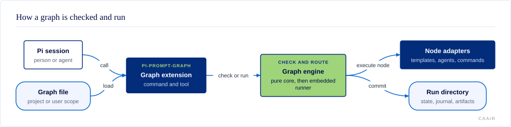

# @centerforagenticai/pi-prompt-graph

**Kind:** extension · **Status:** experimental · **Pi:** ^0.85.1 · **Node:** >=24

Conditional, cyclic workflow graphs for Pi, built from commands, templates,
delegated agents, human questions, and state updates.

## What it does

`pi-prompt-graph` loads a Markdown graph from `.pi/graphs/` or
`~/.pi/agent/graphs/`, checks it, and can run it in the current Pi session. A
graph routes on node results, so it can express a bounded loop such as
`implement → verify → implement` without asking the agent to remember the loop.

- Parses long-form YAML frontmatter and a compact arrow shorthand.
- Checks destinations, terminal reachability, attempt budgets, and routing.
- Runs `template`, `agent`, `command`, `human`, and `set` nodes.
- Records state and an append-only journal under `.pi/runs/<runId>/`.
- Supports static fan-out, joins, artifacts, result projection, resume, run
  inspection, token accounting, cost ceilings, and per-node tool allowlists.

The status is experimental because the installed `/graph run` path still has
important limits. Its `EmbeddedRunner` overlaps independent fan-out branches up
to the graph's `maxConcurrency`, while template nodes remain limited to one
shared live session. `/graph check` does not validate template or agent names
against a catalogue. Dynamic fan-out and join identity across some cycle laps
are not implemented. The command path does not use the concurrent
`DurableRunner`, and the package root does not expose its runtime values. The
`graph_transition` tool checks whether a target is legal but does not yet change
the active run.

## How it fits



The extension registers one command and one tool with Pi. The command loader
finds a graph file, then the pure parser, compiler, validator, and routing
machine turn it into an executable graph. `EmbeddedRunner` calls only the
adapter needed by each node. It commits state, journal records, and declared
artifacts to the run directory. The pure layers do not call Pi, a model, the
filesystem, a session, or the clock.

## Install and enable

Install the public npm package, then restart Pi:

```sh
pi install npm:@centerforagenticai/pi-prompt-graph
```

For one run without installing it:

```sh
pi -e npm:@centerforagenticai/pi-prompt-graph
```

The package manifest enables `./dist/index.js`. It needs Pi `^0.85.1` and Node
`>=24`. A graph with `template` nodes also needs a compatible
`pi-prompt-template-model` extension. An `agent` node starts a Pi child process
from an agent definition found in `.agents/`, `~/.agents/`, `.pi/agents/`, or
`~/.pi/agent/agents/`.

## Surface

| Kind | Name | Purpose |
| --- | --- | --- |
| Command | `/graph check <name>` | Load and compile a graph without running nodes. |
| Command | `/graph show <name>` | Print a Mermaid flowchart for the compiled graph. |
| Command | `/graph expand <name>` | Expand shorthand graph syntax. |
| Command | `/graph run <name> [--input <json>]` | Run a graph through `EmbeddedRunner`. |
| Command | `/graph resume <runId> [answer]` | Resume a suspended run or answer a human node. |
| Command | `/graph explain <runId>` | Reconstruct the route from its journal. |
| Command | `/graph inspect <runId> [options]` | Inspect bounded run state and journal data. |
| Command | `/graph status <runId>` | Show one bounded status line. |
| Command | `/graph goto <runId> <node>` | Record an operator move in the journal. |
| Command | `/graph stop <runId>` | Record an operator stop in the journal. |
| Tool | `graph_transition` | Check whether a requested transition is legal during an active run. |
| Export | `@centerforagenticai/pi-prompt-graph` | The default Pi extension and its TypeScript contract types. |

It registers no skills.

## Configuration

The extension reads no settings file or environment variable. Graph files are
its configuration. Project graphs in `.pi/graphs/` override same-named user
graphs in `~/.pi/agent/graphs/`. Run data goes to `.pi/runs/` in the current
project.

Each graph declares its own nodes, routes, attempt `budget`, and optional limits.
The compiler defaults `mode` to `session`, `maxConcurrency` to `1` in session
mode or `4` in orchestrated mode, `maxStateBytes` to `1048576`, and `collapse`
to `off`. The session runner is sequential; `/graph run` uses `EmbeddedRunner`,
which applies the graph concurrency limit to independent work and keeps shared
template execution sequential. See [Write and run a graph](docs/writing-a-graph.md)
for the authoring workflow and [the worked examples](examples/README.md) for
complete graphs.

## When it runs

The extension loads with Pi and stays idle until `/graph` or
`graph_transition` is called. It also hooks these Pi events:

- `tool_call` enforces the current node's declared tool allowlist.
- `input` pauses an active run at the next node boundary when a person or RPC
  client sends input. Extension-generated input does not pause the run.
- `session_shutdown` suspends an active run at the next node boundary.
- `session_start` warns once about the newest suspended run under `.pi/runs/`.

Nodes run only after `/graph run` or `/graph resume`. The extension starts no
daemon and does no periodic background work.

## Develop

The source is maintained in a private repository and published as release snapshots; contributions are welcome as pull requests on [GitHub](https://github.com/CenterForAgenticAI/tools), which maintainers carry into the source repository.

```sh
npm install
npm run test:public-package
```

## Documentation

- [`docs/design-intent.md`](docs/design-intent.md): the original “What it is” and “What it is not” design intent.
- [`docs/writing-a-graph.md`](docs/writing-a-graph.md): practical graph authoring and command workflow.
- [`docs/diagrams/`](docs/diagrams/): architecture diagram source and generated SVG.
- [`examples/`](examples/README.md): four tested graphs covering cycles, review routing, fan-out, joins, and human approval.

## License

MIT. See [LICENSE](LICENSE).
