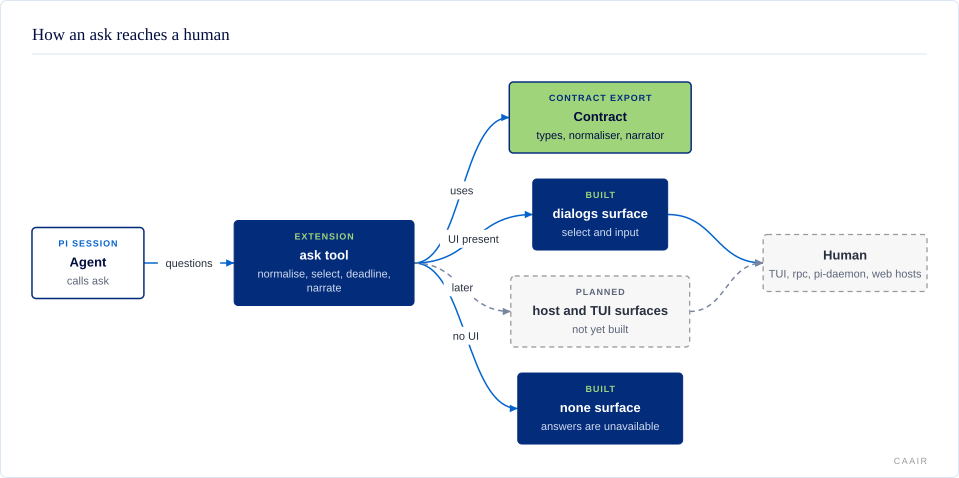

# @centerforagenticai/pi-question

**Kind:** extension · **Status:** experimental · **Pi:** ^0.87.1 · **Node:** >=24

Structured human questions for Pi. The package registers an `ask` tool and
exports a runtime-independent question contract for other packages.

## What it does

An agent calls `ask` with one or more questions and options. The extension uses
Pi's `select` and `input` dialogs when the session declares a UI. Without a UI,
it returns `unavailable` instead of turning a missing answer into a selection.

Each answer has an explicit status: `answered`, `cancelled`, `timeout`,
`dismissed`, or `unavailable`. An opt-in timeout default is represented as
`answered` with `defaulted: true`, so consumers can distinguish it from a human
choice.

- **Compatible input and output.** The tool keeps the name `ask` and accepts a
  superset of the [pi-ask-tool](https://github.com/devkade/pi-ask-tool) schema.
- **Headless-safe behavior.** Sessions without a declared UI receive an explicit
  `unavailable` result.
- **Optional timeouts.** A deadline can cancel, fail, or apply the recommended
  option where the question category permits it.
- **Pure shared contract.** `@centerforagenticai/pi-question/contract` has no Pi
  SDK, Node.js, or TypeBox runtime dependency.

## How it fits



The `ask` tool normalizes the request, chooses one surface from declared
capability, waits for an answer or deadline, and narrates the result. Two
surfaces exist today: `dialogs` when the session declares a UI, and `none`
otherwise. Dedicated host and rich TUI surfaces are not implemented.

The extension source entry remains `src/index.ts`, while consumers that only
need data types and helpers import the separate contract export.

## Install and enable

Install the extension from npm:

```sh
pi install npm:@centerforagenticai/pi-question
```

Restart Pi or run `/reload` after installation. Do not load this package beside
pi-ask-tool because both register a tool named `ask`.

The package requires Pi `^0.87.1` and Node.js `>=24`.

## Surface

| Kind | Name | Purpose |
| --- | --- | --- |
| Tool | `ask` | Ask one or more structured questions. |
| Export | `@centerforagenticai/pi-question/contract` | Types, normalization, narration, details, and limits without loading Pi. |

The extension registers no commands, skills, prompts, themes, or event
handlers. See the [contract reference](docs/contract.md) and
[surface reference](docs/surfaces.md) for the public API and behavior.

## Configuration

Settings use the `piQuestion` key. User settings live in
`~/.pi/agent/settings.json`; project settings in `.pi/settings.json` override
them.

```json
{
  "piQuestion": {
    "timeoutMs": 0,
    "onTimeout": "cancel",
    "surfaces": ["host", "tui", "dialogs"],
    "blockedSignal": true
  }
}
```

| Key | Default | Meaning |
| --- | --- | --- |
| `timeoutMs` | `0` | Deadline in milliseconds; `0` waits forever. |
| `onTimeout` | `"cancel"` | `"cancel"`, `"recommended"`, or `"error"`. |
| `surfaces` | `["host", "tui", "dialogs"]` | Allowed surfaces; only `dialogs` is implemented. |
| `blockedSignal` | `true` | Emit `herdr:blocked` while waiting for a human. |

Invalid values are ignored one settings layer at a time. See the
[configuration reference](docs/configuration.md) for timeout safeguards and
precedence.

## When it runs

The extension runs only when an agent calls `ask`. It starts no background work
and hooks no Pi lifecycle events.

While a dialog waits for a human, the tool emits `herdr:blocked` and clears it
on every exit path. It emits nothing for the `none` surface or when
`blockedSignal` is disabled. Cancellation depends on the host honoring the
forwarded `AbortSignal`; the timeout is not a hard limit for an unresponsive
host.

## Develop

The source is maintained in a private repository and published as release snapshots;
contributions are welcome as pull requests on
[GitHub](https://github.com/CenterForAgenticAI/tools), which maintainers carry into
the source repository.

```sh
npm install
npm run test:public
```

## Documentation

- [Question contract](docs/contract.md): request and answer shapes, invariants,
  compatibility, and exports.
- [Surfaces](docs/surfaces.md): capability selection and dialog behavior.
- [Configuration](docs/configuration.md): settings, precedence, and timeout
  policies.
- [Development](docs/development.md): layout and local commands.
- [Architecture diagram source](docs/diagrams/architecture.json): editable source
  for the rendered diagram.

## License

MIT. See [LICENSE](LICENSE).
