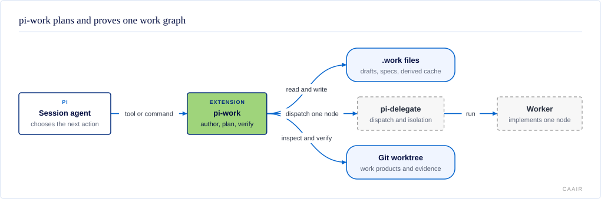

# @centerforagenticai/pi-work

**Kind:** extension · **Status:** experimental · **Pi:** ^0.85.1 · **Node:** >=22.19

Structured workspec authoring, verification, and plan compilation for Pi. A
workspec is a YAML description of agent-directed work and its completion
criteria.

## What it does

pi-work helps an agent turn an outcome into a checked graph of work. It owns the
workspec format and the evidence used to establish completion. The agent in the
current Pi session still decides what runs next, while pi-delegate owns worker
execution.

- Draft and promote a workspec without losing its criteria.
- Validate the graph, dependencies, write scope, and evidence declarations.
- Derive node state from source files and evidence instead of storing status in
  the workspec.
- Compile ready nodes into worker briefs and dispatch exactly one node per call.
- Verify declared evidence against a named Git tree; report failure instead of guessing when a kind is unavailable.

A failed or unexecuted check does not pass. Detailed evidence rules are in
[docs/EVIDENCE.md](docs/EVIDENCE.md).

## How it fits



The agent running the Pi session calls pi-work tools and commands. pi-work reads
and writes Markdown drafts, YAML workspecs, and a cache under `.work/` that it
can rebuild from those sources. It checks
evidence in the target Git worktree. For execution, `work_dispatch` asks the
loaded pi-delegate runtime to dispatch one node; pi-delegate then owns the
worker, isolation, escalation, and result handling. pi-work has no scheduler,
daemon, or persistent run-state service.

## Install and enable

<a id="installing-pi-work"></a>

pi-work is opt-in per project. Install the npm package into the consuming
project's `.pi/settings.json`:

```sh
cd <project>
pi install npm:@centerforagenticai/pi-work -l
```

For an unpublished checkout, add its absolute path instead, merging it into any
existing `packages` array:

```json
{
  "packages": ["/absolute/path/to/pi-work"]
}
```

Restart Pi, then verify the package is listed under `Project packages`:

```sh
pi list
```

It needs Pi `^0.85.1` and Node `>=22.19`. Read
[docs/INSTALLING.md](docs/INSTALLING.md) for npm installation, linked worktrees,
one-run loading, and limiting which package resources load.

## Surface

| Kind | Name | Purpose |
| --- | --- | --- |
| Tool | `work_validate` | Parse and validate a workspec; return typed findings and advisory lints. |
| Tool | `work_promote` | Promote a Markdown draft to a YAML workspec while preserving criteria. |
| Tool | `work_amend_criterion` | Change one criterion through an append-only recorded amendment. |
| Tool | `work_status` | Derive each node as done, ready, blocked, or needing a decision. An open decision with `gates` prevents planning and dispatch of the named top-level nodes and their subtrees; one without `gates` blocks every node. An applicable decision makes a node `needs-decision` unless another prerequisite already makes it `blocked`. |
| Tool | `work_plan` | Compile ready node addresses into plans that point to stored worker briefs, without dispatching. |
| Tool | `work_dispatch` | Compile and submit exactly one node through pi-delegate, or return the plan without claiming dispatch occurred. |
| Tool | `work_verify` | Verify a node's declared evidence in a named Git tree. |
| Commands | `/work-draft`, `/work-promote`, `/work-decompose` | Guide authoring, promotion, and decomposition. |
| Commands | `/work-status`, `/work-next` | Show derived state or hand off one ready round. |
| Skill | `work-authoring` | Draft an outcome and observable criteria. |
| Skill | `work-decomposition` | Assign node boundaries, dependencies, proof, and write scopes. |
| Skill | `work-execution` | Plan, dispatch, verify, and remediate ready work. |

Paths passed to tools are relative to the allowed base directory for that call.
Absolute paths are rejected rather than rewritten.

## Configuration

The extension reads no package-specific settings. Loading it through the
project's `.pi/settings.json` enables all seven tools and discovers all three
skills. The workspec itself carries node, worker, evidence, and write-scope
settings; see the [design record] for the schema and decisions.

<a id="keeping-dist-current-optional-git-hooks"></a>

Development hooks are optional. `npm run hooks:install` installs all tracked
hooks. `sh scripts/install-git-hooks.sh --build-only` installs only the four
`dist/` rebuild hooks. Their controls are:

| Setting | Effect |
| --- | --- |
| `git config piwork.autobuild true` | Rebuild in linked worktrees too. |
| `git config piwork.autobuild false` | Disable automatic rebuilds. |
| `PI_WORK_NO_AUTOBUILD=1 git commit` | Skip the rebuild for one command. |

The full hook behaviour is in [docs/INSTALLING.md](docs/INSTALLING.md).

## When it runs

pi-work runs only when an agent or person invokes one of its tools or slash
commands. It registers no Pi lifecycle event handlers and starts no background
process. `work_dispatch` performs at most one pi-delegate dispatch per call; it
never waits, sequences, retries, or polls. `work_verify` runs only the evidence
declared for the selected node.

## Develop

Use an isolated worktree because Pi sessions load compiled code from `dist/`.
Give the worktree its own `node_modules`; do not link dependencies back to a
shared checkout.

```sh
git clone https://github.com/CenterForAgenticAI/tools.git
cd tools/packages/pi-work
npm ci
env NPM_CONFIG_USERCONFIG=/dev/null npm run check
```

The gate runs lint, source and test typechecks, hook tests, the compiled
JavaScript tests with coverage, the production build, and the package smoke.
The package smoke must run after the build because the published extension entry
is `./dist/index.js`.

## Documentation

- [docs/INSTALLING.md](docs/INSTALLING.md): installation, project opt-in, development commands, rebuild hooks, and repository layout.
- [docs/SURFACE.md](docs/SURFACE.md): tools, commands, skills, and path rules.
- [docs/DESIGN.md](docs/DESIGN.md): the design constraints behind pi-work's current shape.
- [docs/EVIDENCE.md](docs/EVIDENCE.md): evidence kinds, environment controls, redaction, and command containment.
- [docs/GLOSSARY.md](docs/GLOSSARY.md): project terms used in the design and implementation.
- [docs/diagrams/](docs/diagrams/): architecture diagram source and generated SVG.
- [Design record]: architecture, schema, boundaries, and deferred decisions.
- [ADR index]: accepted architecture decisions.
- [Postmortem]: the predecessor failures that shaped the constraints.

## License

MIT. See [LICENSE](LICENSE).

[design record]: docs/DESIGN.md
[ADR index]: docs/DESIGN.md#design-constraints
[postmortem]: docs/DESIGN.md#design-constraints
